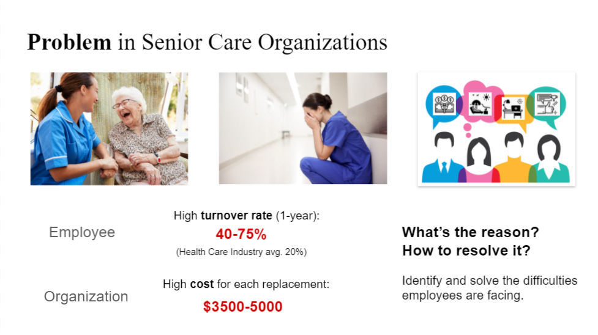
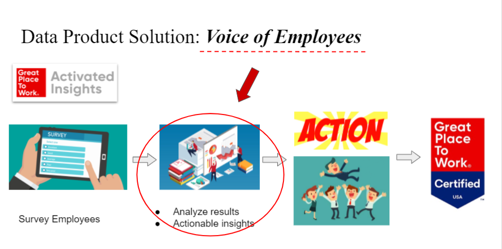
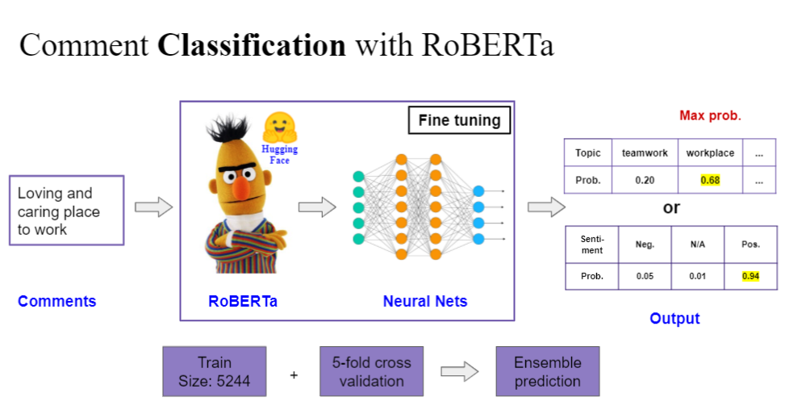
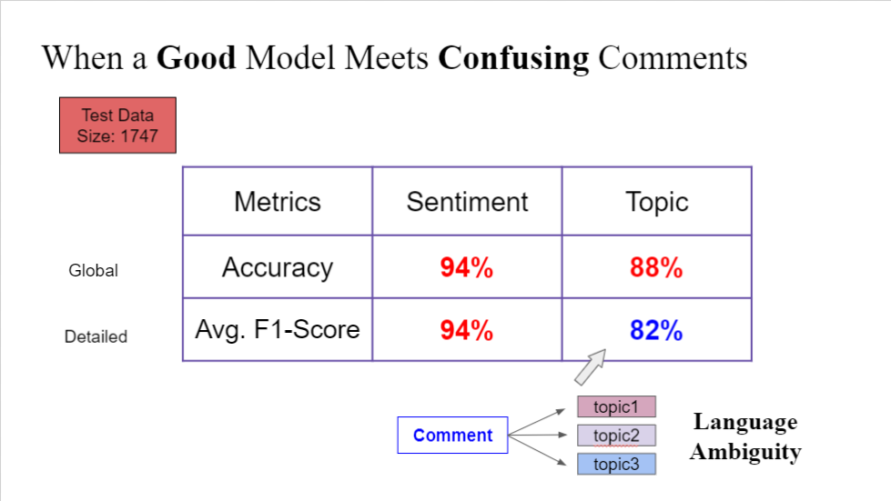
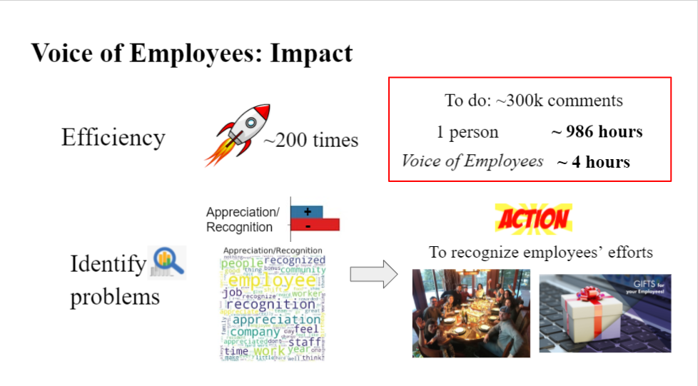
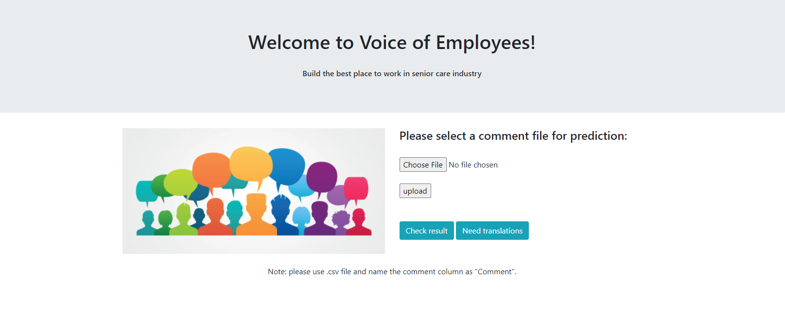
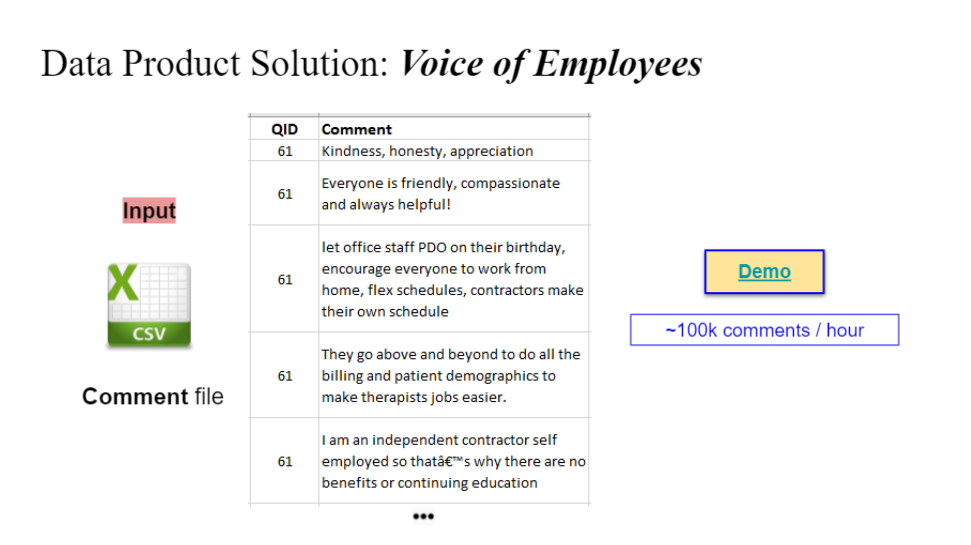
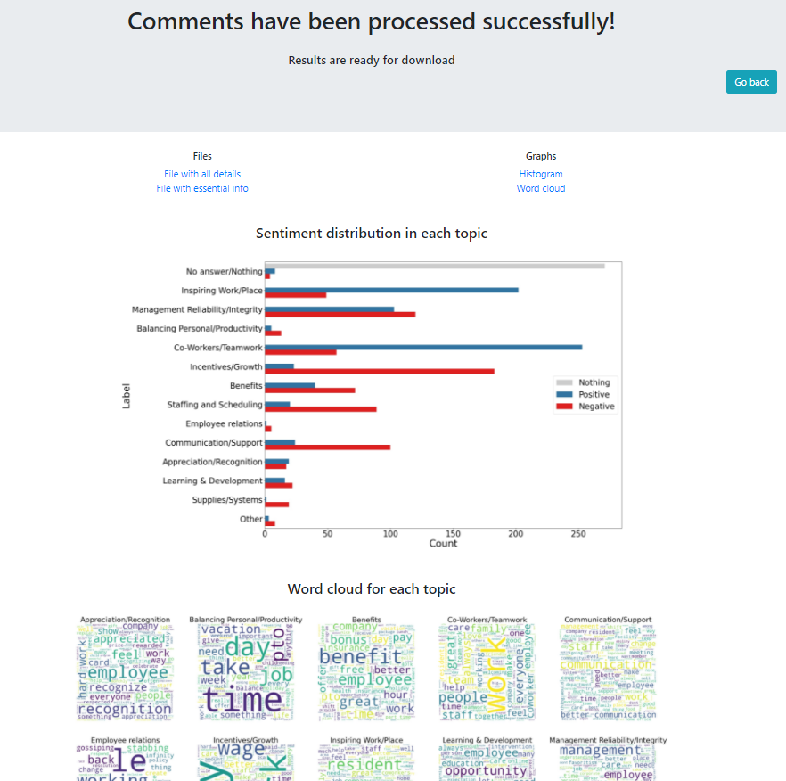

<h1 align="center">NLP Project: Voice of Employees</h1>
<h2 align="center">Automating post-survey processing in <b>senior care</b> industry</h2>

---
<!-- ## Title
 -->

- [Introduction](#introduction)
- [The role of this app](#the-role-of-this-app)
- [Modeling](#modeling)
- [Evaluation](#evaluation)
- [Impact](#impact)
- [Simple Demo](#simple-demo)
  - [Home Page](#home-page)
  - [Data Example](#data-example)
  - [Result page](#result-page)
- [Slides](#slides)
- [About the code](#about-the-code)
  - [file paths - model](#file-paths---model)
  - [file paths - webapp](#file-paths---webapp)
- [Key Dependencies](#key-dependencies)

## Introduction
This is a consulting project finished with **Activated Insights** while I was a Data Science Fellow in the **Insight** - Seattle 20B session.


In senior care industry, the employee turnover rate ranges from 40 to 75%, more than 2 times of the health care industry average. And the organization is costing a lot of money to find new replacements. These are problems the senior care industry is facing. 

On the other hand, Activated Insights is a company that helps other companies to become the best place to work. They conduct surveys among employees of customer companies and offer actionalbe suggestions on improving employees' work satisfactions.

## The role of this app


This NLP app, **Voice of Employees**, helps Activated Insights automating employee engagement survey comment processing including topic and sentiment labeling and visualizations to assist client companies in identifying key factors that inhibit employee benefits and satisfactions.

## Modeling


The modeling process utilized the pretrained roberta-base model from [Hugging Face](https://huggingface.co/).

Two models are built to predict probablity for each class of topics and sentiments separately.

Each model has two parts. The RoBERTa model part is for text encoding and the following neural nets is for predicting.

The models are trained with 5-fold cross-validation techniques on GPUs and saved the best model in each fold for final ensemble predictions to reduce variations.

## Evaluation


This model achieved 94% accuracy and 94% macro F1-score for sentiments with 3 labels and 88% accuracy and 82% macro F1-score for topics with 14 labels. Checkout the slides for a discussion on the language ambiguity in comments.

## Impact

+ Speed up the survey processing by 200 times compared to a human
+ Results help company find clues to improve employee job satisfactions


## Simple Demo
### Home Page

On this home page, one from Activated Insights can upload their survey csv file. After that, the data will be processed automatically and jump to the result page when it is finished.

### Data Example

The data is required to be prepared in csv format and the comment column should have a name "Comment".

### Result page

There are three parts on the result page:
+ files to downloads, including the original probability predicitons
+ a histogram to show sentiments among different topics
+ a wordcloud to show keywords in each topic

## Slides
Reference: [Link to Slides](https://docs.google.com/presentation/d/1CjvxhDRRzBnTV_ujIPk1EqBLOTWKWAgrBcGohVCkXOg/edit?usp=sharing)

---

## About the code
+ The **models_code** folder contains files to train and validate the model.

+ The **WebApp folder** contains files for the web framework only.

+ The **WebApp_deployment** contains files for the web framework and the model to perform only batch prediction.


### file paths - model
```
models_code
│
├───roberta-label
│   ├───input
│   │   └───roberta-base
│   ├───output
│   ├───saved_model
│   └───src
│       │   config.py
│       │   create_folds.py
│       │   dataset.py
│       │   engine.py
│       │   inference.py
│       │   model.py
│       │   train.py
│       │   utils.py
│
└───roberta-sentiment
    ├─── ... similar as above ...
```
To train the model, one first need to download the 'roberta-base' model files from Hugging Face [models](https://huggingface.co/roberta-base). And put the file in the "input" directory as shown above.

These files can be used to finetune other berted-related models for classification and regression problems.

### file paths - webapp
```
WebApp_deployment
└───CommentInsights
    ├───analysis
    │   ├───migrations
    │
    ├───CommentInsights
    │
    ├───model_roberta_classifier_label_data_aug
    │   ├───saved_model
    │
    ├───model_roberta_classifier_sentiment
    │   ├───saved_model
    │
    ├───static
    │   ├───background
    │   ├───data
    │   ├───download_result
    │   └───output
    │
    ├───templates
    │
    └───text_cleaning
```

This is a demo version for the app and some settings for the final version, which is delivered to Activated Insights, are not shown here.

After training the model, one can save the model files in the "saved_model" directory.

To see the webpage, just download this repo and then 
```
cd some_path/WebApp_deployment/CommentInsights/

python manage.py runserver
```

## Key Dependencies
+ python=3.6.9
+ django=3.0.2
+ nltk=3.5
+ scikit-learn=0.23.1
+ seaborn=0.10.1
+ tokenizers=0.7.0
+ torch=1.5.0
+ transformers=2.10.0
+ wordcloud=1.7.0

